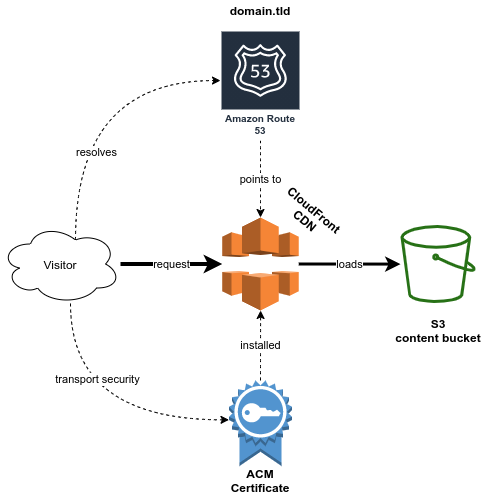

# AWS CDK: Static Website

An AWS CDK Level 3 construct that implements an opinionated static website in AWS using:
- A public readable S3 bucket, that mirrors the contents of local directory of `.html` files and related assets
- A CloudFront distribution, that caches the S3 delivery and enforces HTTPS
- Route53 record(s) that route one or multiple public domains to S3
- A certificate for the provided public domain(s) for HTTPS



## Usage

Install package:

```
$ npm install @ukautz/aws-cdk-static-website
```

Then in your stack:

```typescript
import * as cdk from '@aws-cdk/core';
import * as route53 from '@aws-cdk/aws-route53';
import { StaticWebsite } from '@ukautz/aws-cdk-static-website';

export class YourStack extends cdk.Stack {
  constructor(scope: cdk.Construct, id: string, props?: cdk.Stack) {
    super(scope, id, props);

    // load (or create) a hosted zone, in which the record(s) will be created
    const hostedZone = route53.HostedZone.fromLookup(this, 'HostedZone', {
      domainName: 'your-domain.tld',
    });

    // create a static website, that uploads and serves contents from a local folder
    new StaticWebsite(this, 'StaticWebsite', {
      directory: '/path/to/where/your/contents/are',
      domain: 'blog.your-domain.tld',
      hostedZone,
    });
  }
}
```

**Note**: See the [`StaticWebsiteProps` interface](docs/interfaces/staticwebsiteprops.md) for all available properties.

## License

[MIT](LICENSE)
